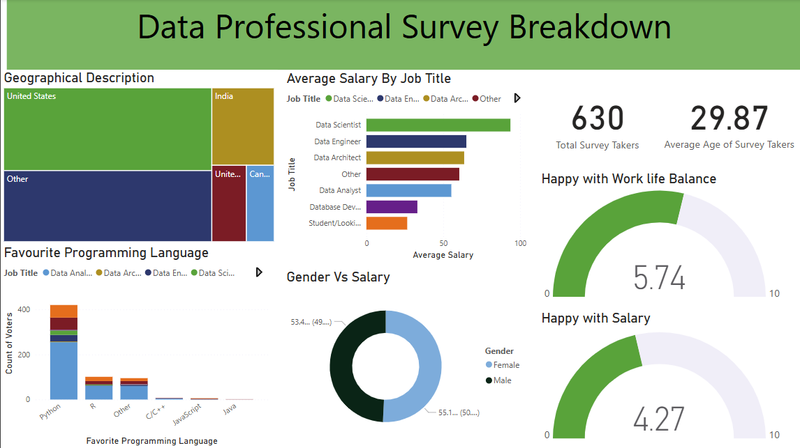

# Power BI Dashboard - Portfolio Project

## Overview
This project is a professional Power BI dashboard designed for data analytics, providing insightful visualizations and performance tracking.

## Features
- **Interactive Visuals:** Dynamic charts and graphs for insightful analysis.
- **KPI Tracking:** Business performance indicators for better decision-making.
- **User-Friendly Interface:** Easy navigation with interactive elements.

## Installation & Usage
1. Download the `.pbix` file from this repository.
2. Open the file using Power BI Desktop.
3. Refresh the data to update the dashboard.

## Preview

## Technologies Used
- **Power BI** for data visualization

## Author
Aditya Sharma

## License
This project is licensed under the MIT License.

